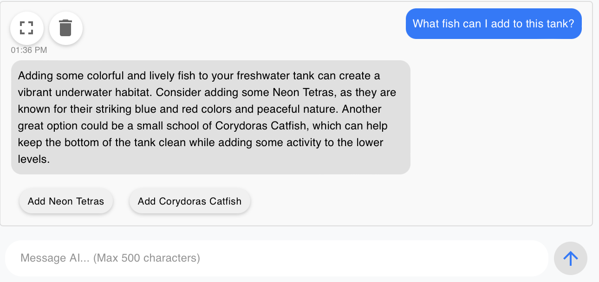
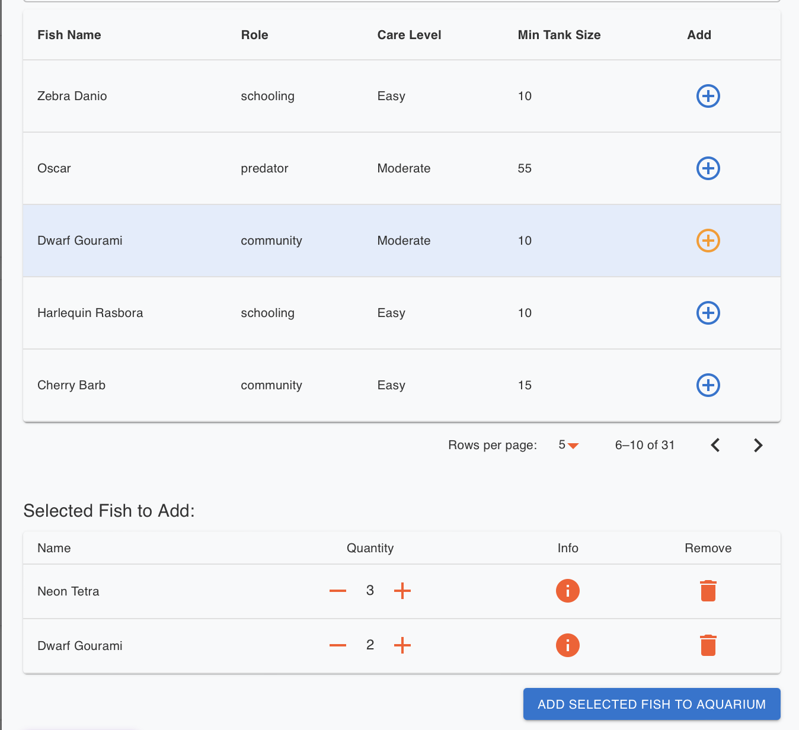
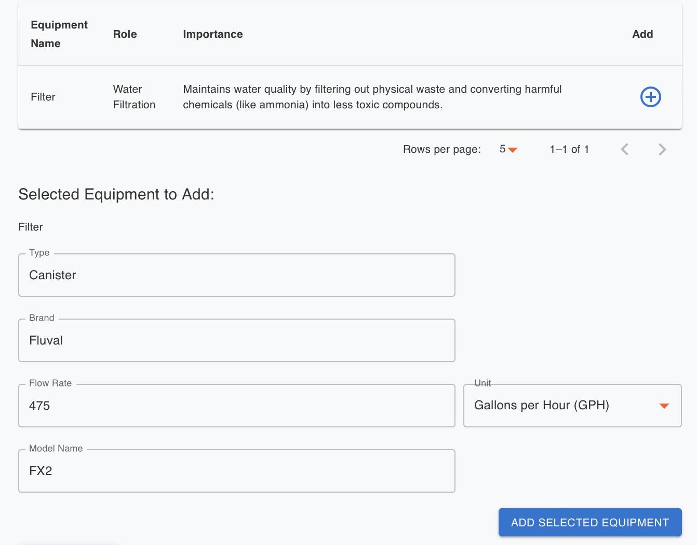
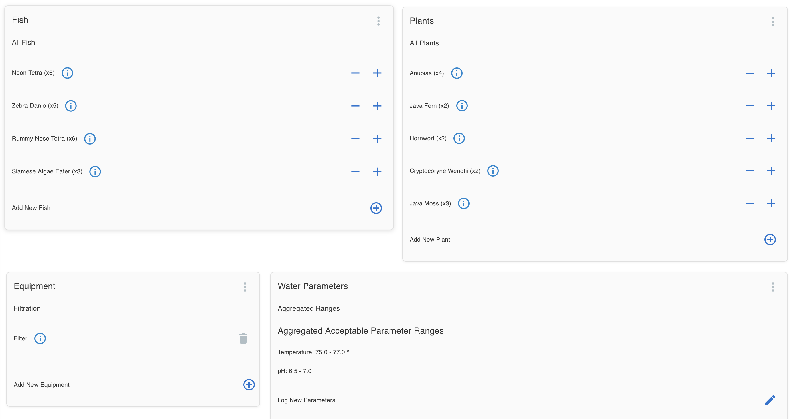
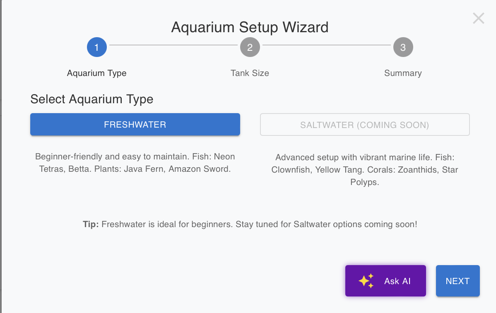
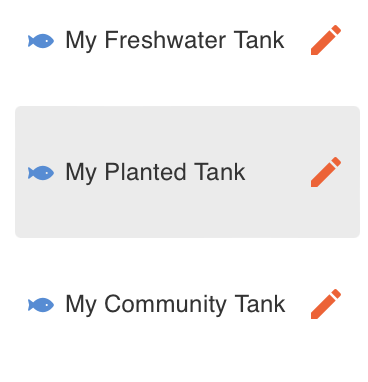
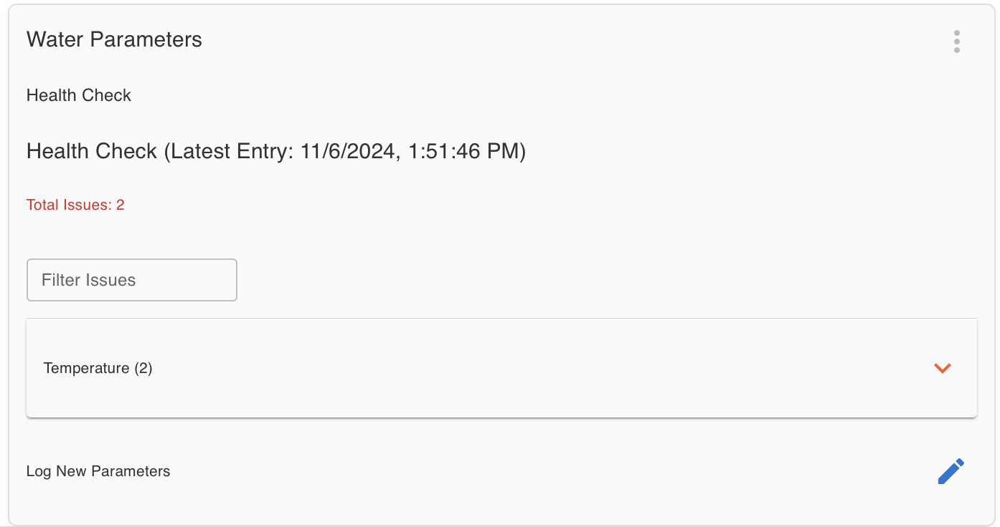

# AquaMind AI: Your AI-Powered Aquarium Stocking Assistant

## Overview

Welcome to **AquaMind**! AquaMind is an AI-driven assistant that empowers aquarium enthusiasts of all levels to easily manage and care for their aquariums. By leveraging advanced AI, AquaMind provides custom recommendations tailored to the unique needs and conditions of your aquarium, making it simple for anyone to make informed decisions on stocking, maintenance, and overall aquarium health. Whether you're a beginner or a pro, AquaMind makes it easy to learn how to create and maintain a thriving aquatic environment, with advice and guidance perfectly matched to your setup. From personalized care insights to interactive management features, AquaMind helps make aquarium care more accessible, engaging, and stress-free.

## Table of Contents

- [Demo](#demo)
- [Features](#features)
- [Tech Stack](#tech-stack)
- [Setup and Installation](#setup-and-installation)
- [Future Improvements](#future-improvements)

## Demo

Check out the live demo: [Link to demo](https://www.aquamind.fish)

## Features 🌊

### 1. AI-Powered Aquarium Management 🐠🤖💬

AquaMind makes managing your aquarium simple and effective by combining intelligent stocking recommendations, personalized advice, and real-time guidance. AquaMind's AI analyzes your tank specifications—such as size, water type, and existing species—to provide smart stocking suggestions, factoring in fish compatibility, bioload, and user preferences to ensure a balanced and healthy environment. With ChatGPT integration, AquaMind offers conversational, expert-level guidance tailored to your specific setup. Ask questions, receive detailed explanations, and get step-by-step care instructions, all by chatting with AquaMind AI. Whether you're a beginner or an experienced aquarist, AquaMind empowers you to create and maintain a thriving aquarium with ease and confidence.

<p align="center">
  
</p>

<p align="center">
  
  
</p>

### 2. Easy Aquarium Monitoring & Logging 📊🐠

With AquaMind's intuitive monitoring and logging features, keeping track of your aquarium's health has never been easier. Log key parameters like water temperature, pH levels, nitrate levels, and more, all within the app. AquaMind uses this data to provide real-time insights and alerts, helping you spot trends and identify potential issues early. This continuous monitoring empowers you to make timely adjustments, ensuring your aquarium remains a stable and healthy environment for your aquatic life.

<p align="center">
  
</p>

### 3. Seamless Setup Wizard & Multi-Aquarium Management 🛠️🐟

AquaMind makes setting up and managing aquariums easy. The intuitive Aquarium Setup Wizard guides you step-by-step through the initial setup process as well as providing real-time AI-powered assistance to help users make their dream aquarium a reality. Managing multiple aquariums is just as effortless—easily switch between tanks, track individual parameters, and receive customized care reminders for each setup, making multi-aquarium care accessible and stress-free.

<p align="center">
  
</p>

<p align="center">
  
</p>

### 4. Personalized Care and Maintenance Suggestions 📝

Get personalized care instructions, feeding schedules, and maintenance tips based on your aquarium setup and the species you keep. AquaMind AI continuously learns from user interactions to provide more tailored advice over time.

<p align="center">
  
</p>

### 5. IoT realtime connectivity (Coming soon) 🌐📡

AquaMind will soon connect with IoT sensors placed in your aquarium to monitor real-time water conditions, such as temperature, pH, ammonia, and nitrate levels. These sensors will transmit live data via AWS IoT services and process the information using Amazon SQS or Amazon Kinesis to ensure reliable, scalable data streams.

## Tech Stack

### Frontend:

- **React**: User interface for managing aquariums and viewing data.
- **TypeScript**: Statically typed superset of JavaScript that heavily reduces risk of typing based runtime errors.
- **Axios**: JavaScript library for making HTTP requests to backend services

### Backend:

- **Go**: Microservices architecture for handling API requests and business logic.
- **GPT-4**: AI integration for delivering personalized advice.

### Database:

- **PostgreSQL**: Secure, relational database for storing tank data and user profiles.

### Infrastructure:

- **Kubernetes**: Orchestrates microservices for scalability and fault tolerance.
- **Docker**: Containerize individual backend services to be handled by Kubernetes
- **AWS**: Cloud infrastructure for hosting, scaling, and managing resources.

## Setup and Installation

- **React** installed on your machine.
- AWS account with IAM privileges for utulized services
- **AWS CLI** or other means to configure AWS credentials.

### Clone the Repository

```bash
git clone https://github.com/stevenpstansberry/AquaMind-AI.git
cd AquaMind-AI/Frontend
```

### Install Dependencies

```bash
npm install
```

### Set up Environmnetal Variables

If you wish to obtain the neccessary API keys and other secrets please feel free to contact me!
If you already obtained such information, declare the following in your .env file within the frontend.

```bash
REACT_APP_AQUAMIND_PROD_URL=<your_aquamind_prod_url>
REACT_APP_AQUAMIND_PROD_KEY=<your_aquamind_prod_key>
REACT_APP_OPENAI_API_URL=<your_openai_api_url>
```

### Run the Application

Start the development server

```bash
npm start
```

This will run the app locally at http://localhost:3000 by default

## Future Improvements

1. Implement a mobile app
2. Social Features - Add abilty to view other's aquariums
3. Add wish list
